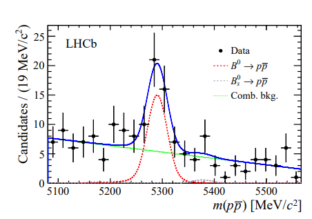

Material available in the [data](../data) folder:
- `rarest_b0_decay.dat` - dataset collected by a B-meson experiment

  
# [0] WARM UP

Download and run tutorials rf502, rf503 (RooWorkspace), rf511
(factory) and rf601 (Minuit)
https://root.cern/doc/master/group__tutorial__roofit.html

--

# [1] Hands-on: Composite Model, one-dimensional numeric convolution (ADVANCED)

## Exercise A - LHCb: First Observation of the Rare Decay $ B^0 \to p\bar{p} $
**Topics: 
composite model; pull; residuals; fit instability**

_Inspired by Figure 1 in:  
**First observation of the rare purely baryonic decay $B^0 \to p\bar{p}$**,  
[arXiv:1709.01156v2 \[hep -ex\] 6 Dec 2017](
https://arxiv.org/abs/1709.01156)\
See also [https://cerncourier.com/a/the-rarest-b0-decay-ever-observed/](https://cerncourier.com/a/the-rarest-b0-decay-ever-observed/)_



In 2017 the LHCb collaboration has observed the rare baryonic decay $B^0 \to p\bar{p}$. The branching fraction was measured at the level of about 1.3 per 100 million decays, which makes this decay mode the rarest decay of a $B^0$ meson ever observed. It is also the rarest observed hadronic decay of
all beauty mesons.\
The search for the rare decays $B^0 \to p\bar{p}$ and $B_S^0 \to p\bar{p}$ had previously been
performed by LHCb with the full 3 fb--1 data sample collected during
the first run of the LHC. An excess of $B^0 \to p\bar{p}$ candidates with respect to the background - only hypothesis is observed with a statistical
significance of 5.3 standard deviations. The hint of a $B_S^0 \to p\bar{p}$ signal
reported in 2013 is, however, not confirmed, and an upper limit for the corresponding branching fraction has been set. The measured $B^0 \to p\bar{p}$ and
$B_S^0 \to p\bar{p}$ branching fractions are compatible with the latest theoretical
calculations

The exercise aims to reproduce the Invariant Mass Distribution Figure 1

### Instructions

#### 1. Download
- `rarest_b0_decay.dat` - dataset collected by a B-meson experiment

#### 2. Load the **unbinned dataset**:
   ```cpp
   RooDataSet data = *RooDataSet::read("rarest_b0_decay.dat", x, "v");
   ```
   
#### 3. Using RooFit, define an **extended composite model** for invariant mass with:
  - a background component (your choice: flat, polynomial, exponential, ...)
  - a Gaussian peak around the $B^0$ mass
  - a Guassian peak around the $B_S^0$ mass
  
#### 4. Fit the model using Maximum Likelihood

#### 5. Plot data and model; superimpose components with different colors.
  - use the named functions `RooFit::Components(...)` 
  - use the named functions `RooFit::LineColor(...)`

#### 6. Create histograms of residuals and pulls.
  - Refer to:
  <br> [https://root.cern.ch/doc/master/rf109__chi2residpull_8C.html](https://root.cern.ch/doc/master/rf109__chi2residpull_8C.html)

> Note: methods `residHist(...)` and `pull(..)` by default compute residuals and pulls of the latest-plotted histogram with respect to the latest-plotted curve. The correct procedure is
>  - Construct a histogram with the residuals of the data w.r.t. the curve
>  - Construct a histogram with the pulls of the data w.r.t the curve
>  - Create a new frame to draw the residual distribution and add the distribution to the frame
>  - Create a new frame to draw the pull distribution and add the distribution to the frame


<!--


In 2017, the LHCb Collaboration observed the rare baryonic decay \( B^0 \to p\bar{p} \).  
The branching fraction is about **1.3  10^-8**, making it the rarest observed hadronic decay of any beauty meson.


Exercise ARIADNE Liquid Argon Time Projection Chamber


composite model, Convolution\


Inspired by Figures 6 and 12 of:
Optical Readout of the ARIADNE LArTPC Using a Timepix3-Based Camera.

The ARIADNE experiment is a 1-ton dual-phase LArTPC used for R&D in future liquid-argon neutrino detectors.


Inspired by Figure 6 (right) "The negative gradient of the summed ToT
distribution." and by Figure 12 "The distribution of the lifetime
-corrected ToT summation for a population of through -going muon
tracks."\
of "Optical Readout of the ARIADNE LArTPC Using a Timepix3 -Based
Camera"\
Instruments 2020, 4(4), 35; https://doi.org/10.3390/instruments4040035\
https://www.mdpi.com/2410 -390X/4/4/35#\

Future Liquid Argon Time Projection Chambers in the neutrino sector will
be able to reach the kiloton -scale ---for example, four 17,000 ton
LArTPCs have been proposed for use on the DUNE project. Given the high
construction and operating costs, as well as the sheer complexity of
such large detectors, early and innovative R&D therefor e has the
potential for a large return on investment over an experiment's
lifetime. The ARIADNE (ARgon ImAging DetectioN chambEr) Experiment is
based around a 1 -ton dual -phase LAr TPC. Using this detector, the
project aims to demonstrate the feasibility of optical readout of
LArTPCs on a large scale and develop an ongoing program for the
characterisation and maturation of such technology.\
Part 1: COMPOSITE MODEL\
This exercise aims to reproduce the Figure 6 representing negative
gradient of the summed Time Over Threshold distribution as a function of
the drift time.\
- Define the drift time as the observable.\
Take the range, binning and units from the final plot.\
- Download\
ariadne_g006_plus_400.dat binned dataset taken from figure 6\
(with an additional pedestal of 400 counts)\
- As described in the paper data are distributed according to a Landau
peak\
Make a composite UNIFORM + LANDAU model. Make a non -extended model but
let the fraction of signal having a range larger than usual (say -0.5 \<
fs \< 1.5) to let background underfluct uate.\
- Read the binned dataset and fill a RooDataHist:\
// Example code for c++\
// (x is the RooRealVar observable):\
RooDataHist data{"data", "data", x};\
ifstream file("filename.txt");\
double val, weight;\
while (!file.eof()) {\
file \>\> val \>\> weight;\
x.setVal(val);\
data.set(x weight); // (\*)\
} - Fit the model to the data.\
Save the fit results to an object RooFitResults.\
Plot the data and the fitted model.\
Plot also the signal component in red and the bkg component in black.\
Write the best fit parameters on the plot too. (hint: paramOn(...)
method of RooAbsPdf).\
(submit source code, plots and a text file with the fit results)

Hint : Range and binning of the observable shall be defined in such a
way to match the histogram of the input file

Use: RooRealVar::setBins(...)\
(\*) Don't import underflow (overflow) bin

PART 2 CONVOLUTION\
This exercise aims to reproduce the Figure 12 representing the
distribution of the lifetime -corrected Time over Threshold (ToT)
summation for a population of through -going muon tracks.\
- Define the time as the observable.\
Take the range, binning and units from the final plot.\
- Download\
ariadne_g012.dat binned dataset taken from figure 12\
- As described in the paper a Landau -Gaussian convolution function has
been fitted to the entire distribution.\
Make a model where a LANDAU (the physics) is convolved with the GAUSSIAN
(the detector resolution)\
- Read the binned dataset and fill a RooDataHist:\
// Example code for c++\
// (x is the RooRealVar observable):\
RooDataHist data{"data", "data", x};\
ifstream file("filename.txt");\
double val, weight;\
while (!file.eof()) {\
file \>\> val \>\> weight;\
x.setVal(val);\
data.set(x weight); // (\*)\
} - Fit the model to the data.\
Save the fit results to an object RooFitResults.\
Plot the data and the fitted model.\
Write the best fit parameters on the plot too. (hint: paramOn(...)
method of RooAbsPdf).

(submit source code, plots and a text file with the fit results)\
Hint : Range and binning of the observable shall be defined in such a
way to match the histogram of the input file

Use: RooRealVar::setBins(...)\
(\*) Don't import underflow (overflow) bin

