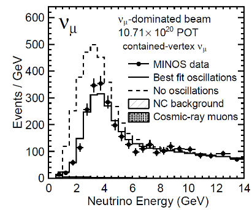

Material available in the [data](../data) folder:
- `minos_2013_data.dat` - unbinned dataset of observed events 
- `minos_2013_mc.dat` - unbinned Monte Carlo dataset for non-oscillated neutrinos 

# [0] WARM UP

Download and run tutorials rf502, rf503 (RooWorkspace), rf511
(factory) and rf601 (Minuit)
https://root.cern/doc/master/group__tutorial__roofit.html

--

# [1] Hands -on: RooWorkspace, Factory , Composite Model; Working with Likelihoods

## Exercise 11 - Composite Model; Working with Likelihoods

<mark>Note: `RooMinuit` has been replaced by `RooMinimizer` starting from ROOT v6.30</mark>

Using the RooFit, create a model consisting of following elements:
- *Observable*: A variable $x$ defined in the range $[−20,20]$. 
- *Model*: The sum of two Gaussian distributions: $$f ⋅gaus_1(..)+(1 −f)⋅gaus_2(..)$$
with the following properties:
  * Both Gaussians share the same mean parameter $mean$, fixed to 0 (constant).
  * The standard deviation of the first Gaussian, `s1`, is defined as $\sigma_1 = 3.ddd$,
   where $ddd$ are the last three digits of your matriculation number. This parameter is constant.
  * The standard deviation of the second Gaussian, `s2`, is a floating parameter
  with range $[3,6]$ and initial value 4.
  * The coefficient `f` has an initial value of 0.5 and is not constant.

**Note**: This model exhibits strong parameter correlations.

### Procedure

1. **Generate a Dataset** 
  <br> Generate an unbinned dataset `data` of 1000 events from the model.
2. **Save the Workspace** 
  <br> Store both the model and the generated dataset in a ROOT file using a RooWorkspace.
3. **Minimize the Likelihood**
  <br>Using the commands illustrated in the lecture as a reference:
    * Construct the unbinned negative log-likelihood (NLL) of the model with respect to the generated dataset using `auto nll = model.createNLL(data);`. The returned object is a `RooAbsReal*`.
    * Create a MINUIT interface `minuit` using a `RooMinizer`(or `RooMinuit`) in older versions. <br> Pass the `nll` object to the constructor.
    * Enable verbose mode to display MINUIT’s internal steps using
`minuit.setVerbose(kTRUE);`.
    * Run **MIGRAD** to perform likelihood minimization.
    * Print the values of all parameters `f`, `mean` , `s1`, and `s2` using
`f.Print()`, ... .
    <br> These values now reflect the MIGRAD optimization.


4. **HESSE Error Calculation**
    * Disable verbose mode.
    * Run **HESSE**, which computes errors using the second derivatives of the NLL at the minimum.
    * Print the updated parameter values
    <br> These now contain the HESSE error estimates.

5. **MINOS Error Calculation for `s2`**
    * Run MINOS for the parameter `s2`. *
    * Print the parameter values again.
   <br> Note that the uncertainties for `s2` are now **asymmetric**. 

6. **Save the Results**
   * Save the fit results:
   * Save a snapshot of the fit result using `minuit.save()`.
   <br> This returns a `RooFitResult*`.
   * Print the result in verbose mode using `Print("v")`.
   <br> The snapshot contains:
     - initial and final parameter values
     - correlation matrix
     - EDM value
     - FCN value
     - MINUIT status code
     - number of computational issues encountered (e.g., null probability during likelihood evaluation).
    * Visualize the correlation matrix using
    <br>
``` cpp
gStyle -\>SetPalette(1); 
   fit_results -\>correlationHist() -\>Draw("colz");
```

7.  **Contour Plot** 
    * Produce a contour plot of `f` vs `s2` corresponding to the confidence levels of **68**%, **95.45**%, **99.73**%, using
    <br><br>
    `RooMinimizer::contour(var1, var2, n1, n2, n3)`
    <br><br>
    where the arguments `n1` , `n2`, and `n3` specify the desired coverange in units of $𝜎$ (in this case 1, 2, and 3). 
    The object returned by this function is a plot frame of type `RooPlot*`.
    <br><br>
    _NOTE_:  The minimizer automatically converts these $\sigma$-levels into the appropriate $\Delta\mathrm{NLL}$ thresholds, according to:
      - **Coverage** values taken from Table 40.2 (column $M = 2$) of the [PDG Statistics Review](https://pdg.lbl.gov/2024/web/viewer.html?file=../reviews/rpp2024-rev-statistics.pdf)
      - **Statistical scale**, depending on whether the minimized function is a chi-square or a negative log-likelihood, (see [RooMinimizer:SetErrorDef()](https://root.cern.ch/doc/master/classROOT_1_1Math_1_1Minimizer.html#aa4e46f31bb8dfb770fcb704e585a3593))
    
      For a detailed description, see the documentation of
      [RooMinimizer::contour()](https://root.cern.ch/doc/master/classRooMinimizer.html#a34df2f70f63b5644507df0e056077c51) ).
    * Draw the resulting contour frame using `RooPlot::Draw()` and save it
    to a file.

--

# [2] Hands-on: Composite Model; Working with Likelihoods (ADVANCED)

## Exercise: Minos
**Topics: 
composite model; working with likelihoods**

> **NOTE**: Here the word _"MINOS"_ refers to the neutrino experiment on the NuMI beamline from Fermilab, Illinois to Soudan Mine in Minnesota.

_Inspired by Figure 1 and Figure 2 of:<br> "Measurement of Neutrino and
Antineutrino Oscillations Using Beam and Atmospheric Data in MINOS"
[arXiv:1304.6335v3 \[hep -ex\] 10 Jul 2013](https://arxiv.org/abs/1304.6335)_




Neutrino oscillation provides direct evidence that neutrinos have non-zero mass and represents the only experimentally confirmed phenomenon beyond the Standard Model of particle interactions.

The MINOS experiment was a long-baseline neutrino experiment designed
to observe neutrino oscillations, an effect directly connected to neutrino mass. The observed energy distribution of muon-neutrino charged-current interactions in the MINOS Far Detector
depends on the oscillation probability, which in turn depends on the mixing angle(s) $\theta_{ij}$ and on the differences between the squared neutrino masses $\Delta m_{ij}^2$ .

MINOS experiment performed precision measurements of $\nu_\mu$ disappearance, caused by neutrino oscillations. 
<br> In the effective two-flavor approximation, the $\nu_\mu$ survival probability is

$𝑃(\nu_\mu \rightarrow
 \nu_\mu) = 1 − \sin^2(2\theta) \sin^2(1.267 \Delta m^2 \frac{L}{E}) $ [Eq. 1]

where
* $\theta$ is the mixing angle,
* $\Delta m^2(\mathrm{eV^2})$ is the mass splitting.
* $L(\mathrm{km})$ is the baseline (here: $L$=730 km),
* $E(\mathrm{GeV})$ is the reconstructed neutrino energy,

### Procedure

**Download:**
- `minos_2013_data.dat` - unbinned dataset of observed events 
- `minos_2013_mc.dat` - unbinned Monte Carlo dataset for non-oscillated neutrinos 

**Define the *observable*:** 
<br> The reconstructed neutrino energy $E$,  as a `RooRealVar` ranging from 0.5 to 14 GeV. 

**Load the unbinned dataset of observed events**
<br> into a `RooDataSet`, using
<br> `RooDataSet data = *RooDataSet::read(" minos_2013_data .dat", energy , "v");`


#### PART 1 - Build the model

Create a PDF describing the energy spectrum and how the spectrum is altered by neutrino oscillations.

- **1. Load the non-oscillated Monte-Carlo sample**
  <br> Load _minos_2013_mc.dat_ into a `RooDataSet` named `mc_noosc`.
  <br>
    > as done before for the observed data

- **2. Turn this MC sample into a histogram-based function**
  <br> This function represents the shape of the energy distribution for non-oscillated neutrinos.
    <br>
    > An **histogram-based** function is represented in RooFit by the `RooHistFunc` class. Use the method `binnedClone()` to create a `RooDataHist` from the RooDataSet and then create a `RooHistFunc` object from the `RooDataHist`.

```cpp
RooDataSet* dd = (RooDataSet*) mc_noosc.reduce(RooArgSet(e)) ;
RooDataHist* dh_mc_noosc = dd->binnedClone();
RooHistFunc func_noosc { "func_mc_noosc", "No oscillation", e, *dh_mc_noosc, 2 };
```

- **3 Construct the oscillation probability function**
 <br>According to Eq. (1), the oscillation probability depends on mixing $\sin^2(2\theta)$, mass splitting $\Delta m^2$, neutrino energy $E$ (the observable) and distance $𝐿=730$ km (a constant).
  * create parameters:
    - `mixing` $= \sin^2(2\theta)$
    - `dm2` $= \Delta m^2$
  * use a `RooFormulaVar` to evaluate Eq. (1).

- **4. Build the final model**
<br>The shape of the energy distribution for oscillated neutrinos is
obtained by modulating the non-oscillated spectrum this function by the oscillation probability
<br> Use a `RooGenericPdf`.
    <br> 
    > Normalization is automatically handled by RooFit.

```cpp
model = RooGenericPdf{ "model", "model", "@0 * @1",\
RooArgSet(prob_osc, func_noosc) };\
o Don't care about normalization. RooFit will adjust it for you.\
```

- **5. Fit and plot**
<br> Fit the model to the data and save the plot as **minos_data.png**.

#### PART 2 - Likelihood Minimization with RooMinizer

<mark>Note: RooMinuit has been replaced by RooMinimizer starting from ROOT v6.30</mark>


Using the commands illustrated in the lecture as a reference, you will now minimize the likelihood explicitly using a RooMinuit (or RooMinimizer) object.

**Minimize the Likelihood**
- Construct the unbinned negative log-likelihood (NLL) of the model with respect to the generated dataset using `auto nll = model.createNLL(data);`. The returned object is a `RooAbsReal*`.

- Create a MINUIT interface `minuit` using a RooMinizer (or RooMinuit in older versions). <br> Pass the `nll` object to the constructor.

- Enable verbose mode to display MINUIT’s internal steps using
`minuit.setVerbose(kTRUE);`.

- Run **MIGRAD** to perform likelihood minimization.

- Print the values of the parameters `mixing`, `dm2` using `f.Print()`, `dm2.Print()`
    <br> These values now reflect the MIGRAD optimization.

**HESSE Error Calculation**
- Disable verbose mode.
- Run **HESSE**, which computes errors using the second derivatives of the NLL at the minimum.
- Print the updated parameter values
    <br> These now contain the HESSE error estimates.

**MINOS Error Calculation for `dm2`**
- Run **MINOS** for parameter `dm2` 
- Print the parameter values again.
   <br> Note that the uncertainties for `dm2` are now **asymmetric**. 

**Save Results**
   * Save the fit results:
   * Save a snapshot of the fit result using `minuit.save()`.
   <br> This returns a `RooFitResult*`.
   * Print the result in verbose mode using `Print("v")`.
   <br> The snapshot contains:
     - initial and final parameter values
     - correlation matrix
     - EDM value
     - FCN value
     - MINUIT status code
     - number of computational issues encountered (e.g., null probability during likelihood evaluation).


**Contour plot**
* Produce a contour plot of `dm2` vs `mixing` corresponding to the confidence levels of **68**%, **95.45**%, **99.73**%, using
    <br><br>
    `RooMinimizer::contour(var1, var2, n1, n2, n3)`
    <br><br>
    where the arguments `n1` , `n2`, and `n3` specify the desired coverange in units of $𝜎$ (in this case 1, 2, and 3). 
    The object returned by this function is a plot frame of type `RooPlot*`.
    <br><br>
    _NOTE_:  The minimizer automatically converts these $\sigma$-levels into the appropriate $\Delta\mathrm{NLL}$ thresholds, according to:
      - **Coverage** values taken from Table 40.2 (column $M = 2$) of the [PDG Statistics Review](https://pdg.lbl.gov/2024/web/viewer.html?file=../reviews/rpp2024-rev-statistics.pdf)
      - **Statistical scale**, depending on whether the minimized function is a chi-square or a negative log-likelihood, (see [RooMinimizer:SetErrorDef()](https://root.cern.ch/doc/master/classROOT_1_1Math_1_1Minimizer.html#aa4e46f31bb8dfb770fcb704e585a3593))
    
      For a detailed description, see the documentation of
      [RooMinimizer::contour()](https://root.cern.ch/doc/master/classRooMinimizer.html#a34df2f70f63b5644507df0e056077c51) ).
    * Draw the resulting contour frame using `RooPlot::Draw()` and save it
    to a file.

-  Zoom the axes manually to improve visibility.
