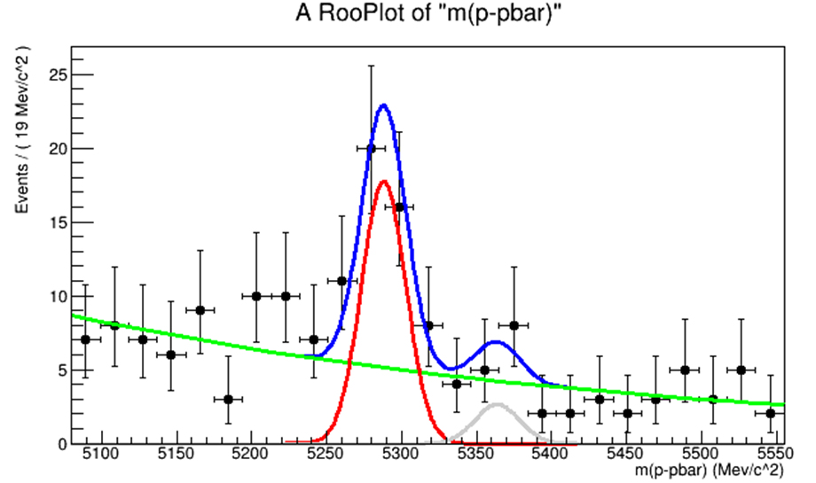
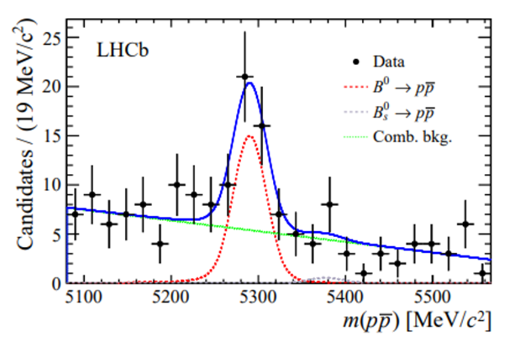
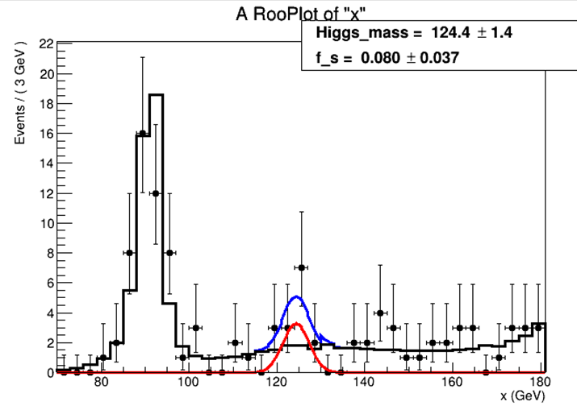
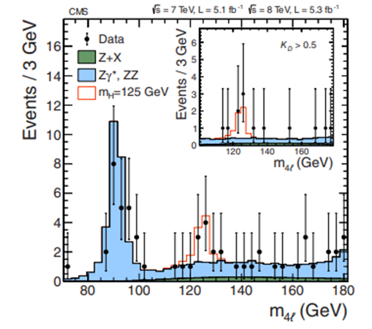
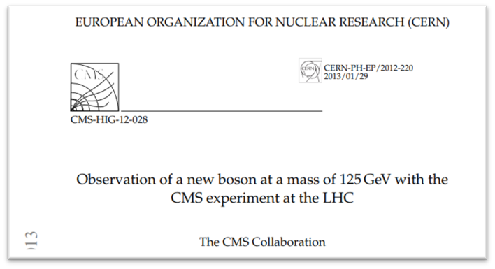
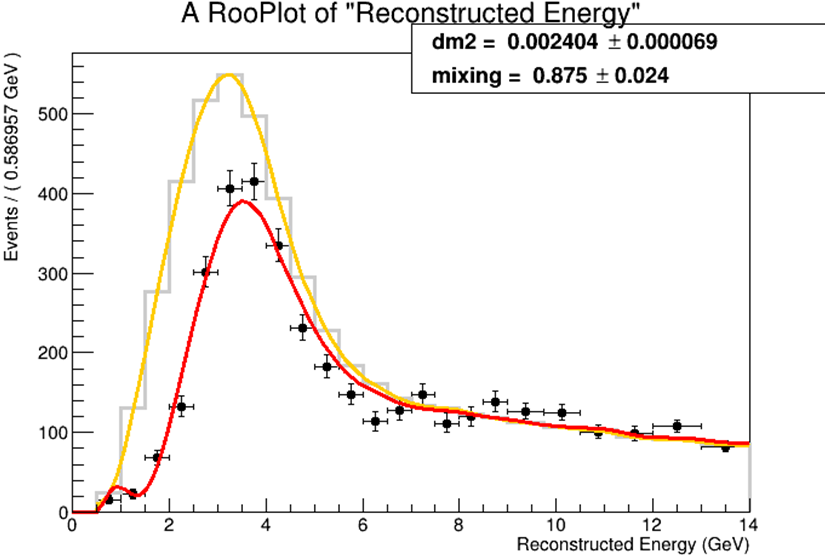
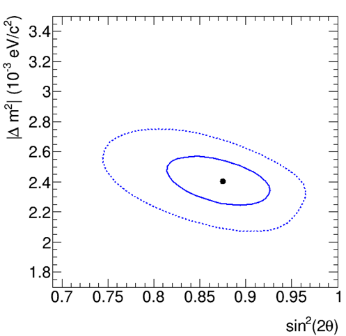
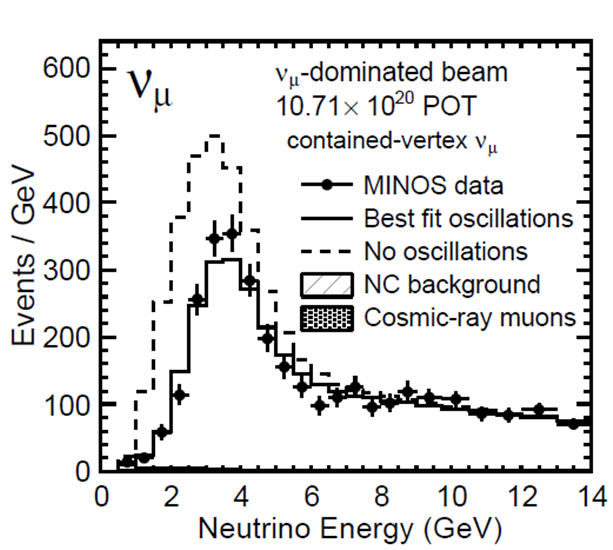
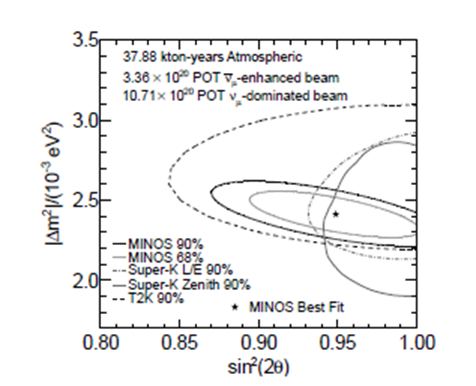
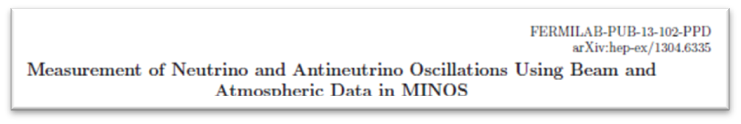

## Statistical Data Analysis for Nuclear and Subnuclear Physics

**Module 3 – Gabriele Sirri**  
Istituto Nazionale di Fisica Nucleare – UNIBO

---

### 🎓 Course Overview

This module offers a **practical introduction to advanced statistical tools** used in High Energy Physics (HEP), with a strong focus on hands-on experience and user-oriented analysis.

#### 🔍 Key Topics

-   **Data Modeling** → RooFit
    
-   **Statistical Analysis** → RooStats
    
    -   Sensitivity plots
        
    -   Hypothesis testing
        
    -   Confidence intervals
        
-   **Multivariate Analysis** → TMVA
    
-   **Unfolding Techniques** → RooUnfold
    

📁 GitHub repository: [Statistical Data Analysis](https://github.com/gabriele-sirri/statistical-data-analysis)

---

### 🧑‍💻 Course Structure

-   4 hands-on lab sessions
    
-   Each session begins with a short lecture (slides)
    
-   Followed by guided exercises or project work
    
-   Assignments can be completed at home and must be submitted via **Virtuale** before the exam
    

💻 Exercises use **PyROOT**  
📌 Submission is mandatory to access the final exam

---

### 🖥️ Computer Lab Setup

You can choose between two options:

1.  **Personal Laptop** (with ROOT installed and RooFit/RooStats/TMVA operative)
    
2.  **Lab PCs** (Windows machines accessible via UNIBO credentials)
    

---

### 📝 Assessment

The final exam includes:

-   Theory questions
    
-   One practical exercise
    
-   One question based on lab work (e.g., code analysis or commentary)
    

✅ **Eligibility**: All assignments must be submitted before the exam

---

### 🧠 Recommended Skills

-   **Statistics**: Familiarity with terminology and core concepts   
-   **Programming**:
    -   C++ (Modern C++)
    -   Python (for scripting)   
-   **ROOT**: Ability to run macros and manage rootfiles
-   **JUPYTER**: notebooks
    

---

### 🧭 Getting Started

Before the lab sessions, please:

1.  Review the [ROOT Primer](https://root.cern.ch/root/htmldoc/guides/primer/ROOTPrimer.html)    
2.  Read “Introduction” and “Conceptual blocks for modeling” from [Practical Statistics for the LHC](https://arxiv.org/abs/1503.07622)    
3.  Brush up on C++ fundamentals: namespaces, classes, inheritance, pointers vs references
    
   

---

### 🔎 ROOT Setup Check

To verify your installation:

```
import ROOT
w = ROOT.RooWorkspace()
```

Expected output:  
`RooFit` [`v3.xx`](https://v3.xx) `-- Developed by Wouter Verkerke and David Kirkby`

```
t = ROOT.TMVA.TMVAGui()
```

Expected error (normal):  
`Error in <TFile::TFile>: file` [`TMVA.root`](https://TMVA.root) `does not exist`

---

### 📚 Teaching Materials

Available on:

-   **Virtuale**: slides, tutorials, assignments    
-   **GitHub**: installation guides and examples
    

---

### 📖 Documentation & Resources

#### RooFit

-   [Manual](https://root.cern/manual/roofit/) 
-   [Quick Start Guide](https://ph-root-2.cern.ch/d/roofit-20-minutes.html)    
-   [User Manual PDF](https://root.cern.ch/download/doc/RooFit_Users_Manual_2.91-33.pdf)    
-   [Tutorials](https://root.cern/doc/master/group__tutorial__roofit.html)
    

#### RooStats

-   [Documentation](https://twiki.cern.ch/twiki/bin/view/RooStats/WebHome)    
-   [Examples](https://github.com/pellicci/UserCode/tree/master/RooFitStat_class)
    

#### ROOT

-   [Main Docs](https://root.cern/doc/master/)    
-   [Class Reference](https://root.cern/doc/master/classes.html)
    

---

### 🧵 Further Reading on C++

-   [ISO C++](http://www.isocpp.org)    
-   [C++ Standards Committee](http://www.open-std.org/jtc1/sc22/wg21/)    
-   [C++ Now](http://cppnow.org/)    
-   [CppCon](http://cppcon.org/)    
-   [Boost Libraries](http://www.boost.org/)    

💡 Learn and apply **Modern C++** (C++11 / C++14 / C++17 / C++20)

---

### 🧪 Student Work Showcase

Examples of professional statistical analyses created during the course, inspired by publications from:

####  LHCb Collaboration

this course: 

original: 

from: 
    
#### CMS Collaboration

this course: 

original: 

from: 
    
#### MINOS Collaboration

this course:  

original:  

from: 
